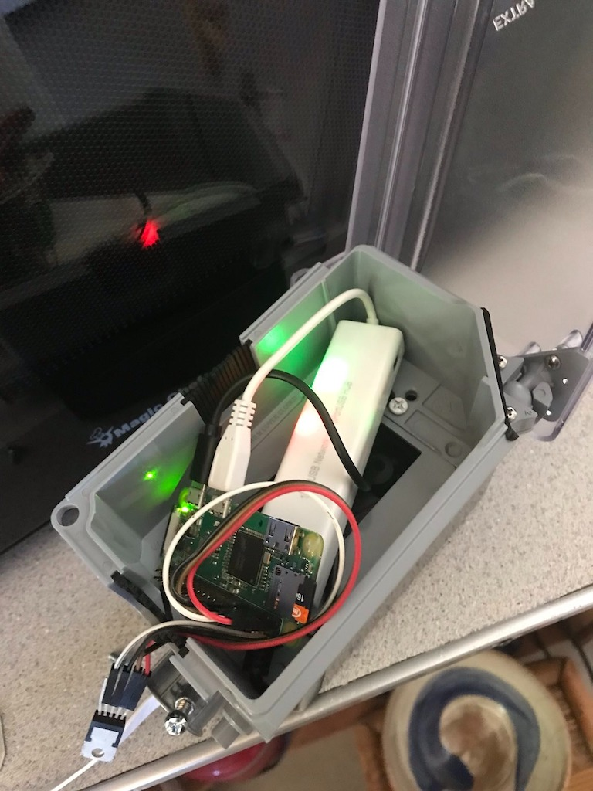
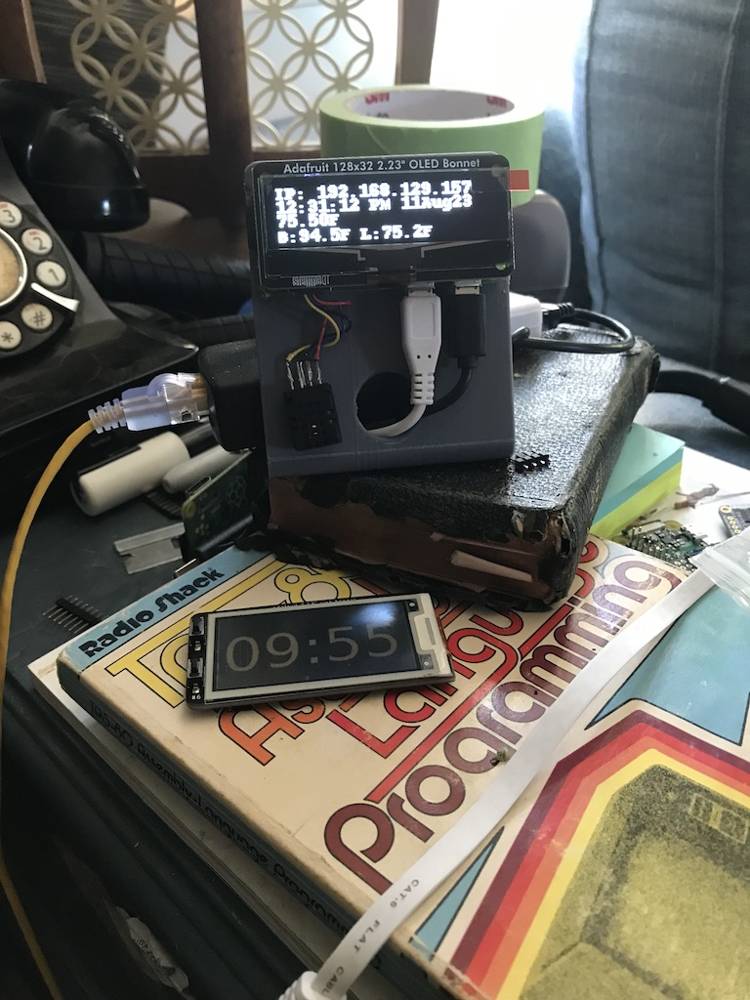
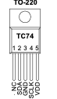
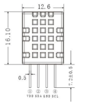
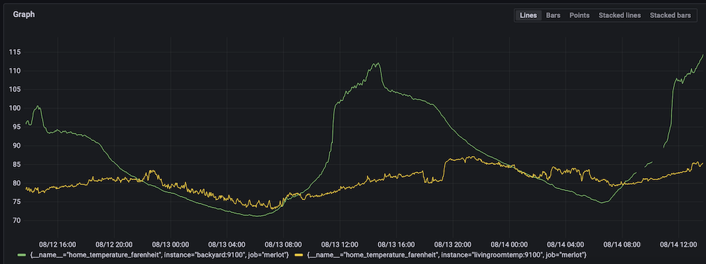

# node-export-temperatures

TL;DR; Cheap prometheus trick. 

We've been rolling out prom/node_exp/vmalert/usw at work for over a year now and I just now realized that you could just dump stuff in /var/lib/prometheus/node-exporter/

# Background

We keep our house comfortable during the summer by opening the house in the evening and closing it up in the morning. I have been meaning to collect data from behind the house and from in front of the house as well as inside to try to figure when is the best time to open and close things up. 

# Hardware

I have a bunch pi zeros and $3 ethernet adapters and poe power adapters. Now I just need to get some temperature sensors. Especially since the one pictured above only has a 1.8 degree F (1 degree C) resolution.

# Sensors

## tc74

## xHT20

# References

- [https://www.devwithimagination.com/2022/08/07/restarting-poe-via-ssh-on-a-usw-lite-16-poe/](https://www.devwithimagination.com/2022/08/07/restarting-poe-via-ssh-on-a-usw-lite-16-poe/)